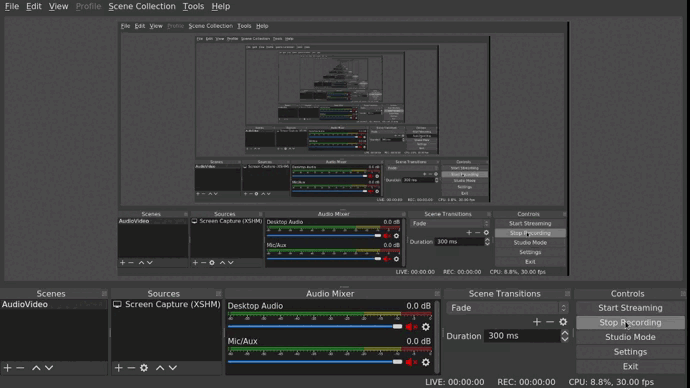
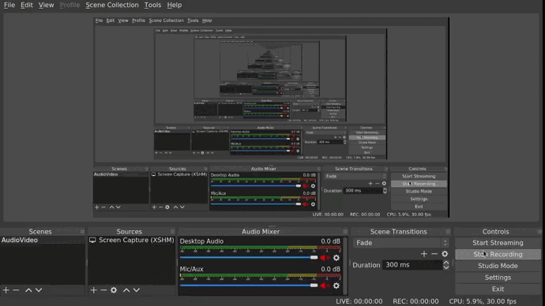

# fifa21-api-replica

API Replica system based on the game "Fifa 21 Ultimate Team" (Script+Backend+Frontend)

## Features:

### Easy navigation:

Easy to use with mouse and/or keyboard.

### Responsive Layout:

Layout that adapts to different screen sizes. It can be improved but it's usable.

### Search Teams

Search teams in the Postgres database.

### Order players, get detailed view of a player and browse results using pagination.

Order results in **ascending** or **descending** order, and browse the pages using a pagination section.

### Search players (by Name or Team)

Search players by **Name** or **Team**.
